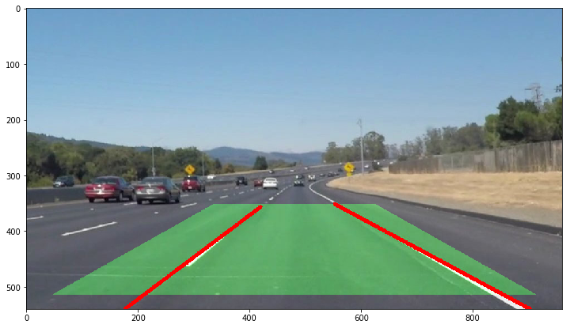
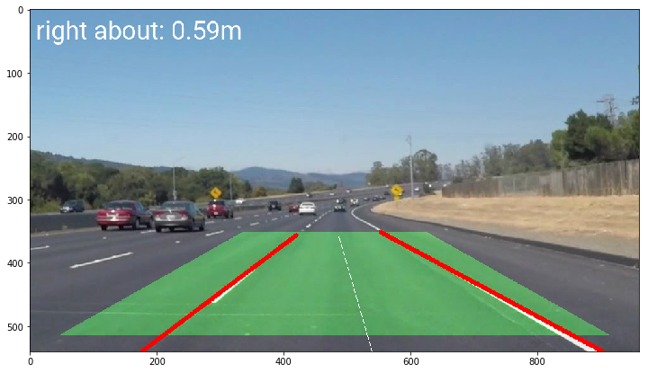
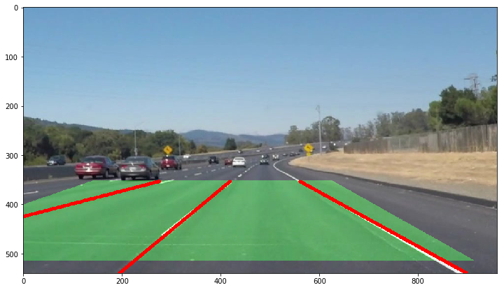
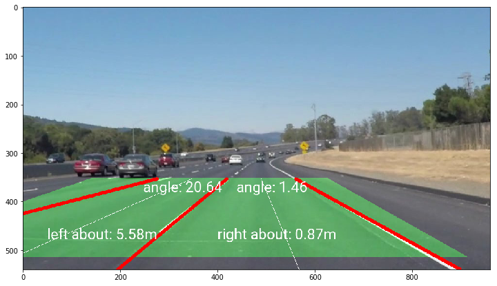
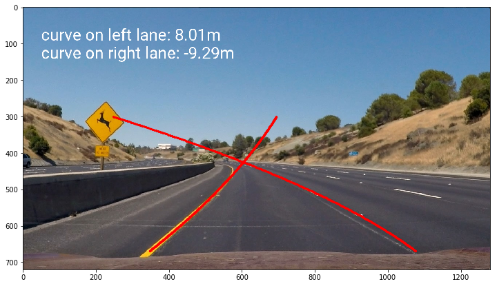
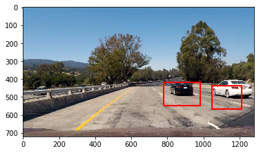
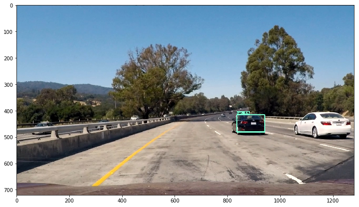
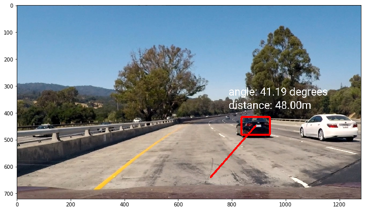
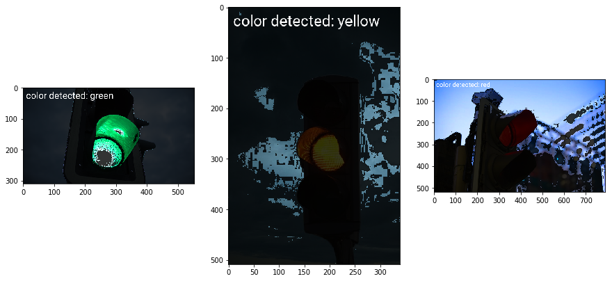

# Self-Driving-Cars-Engine
trying to cover signal processing, lane detection, color detection, and object detection for self-driving car purpose

## What-Done

1. Signal processing (1D smoothing, 2D smoothing, convolution 2 signals, pass-filters)
2. Simple straight lane detection
3. Steering suggestion
4. Multi-lane detection
5. Multi-lane angle
6. Curve-lane detection
7. Car detection using sliding + HOG + eXtreme Boosting
8. Object detection using Tensorflow
9. Distance + Angle for object detection
10. Traffic light detection
11. OCR

## Results

1. Signal processing

2. simple straight lane detection

3. Steering suggestion

4. Multi-lane detection

5. Multi-lane angle

6. Curve-lane detection

7. Car detection using sliding + HOG + eXtreme Boosting

8. Object detection using Tensorflow

9. Distance + Angle for object detection

10. Traffic light detection

