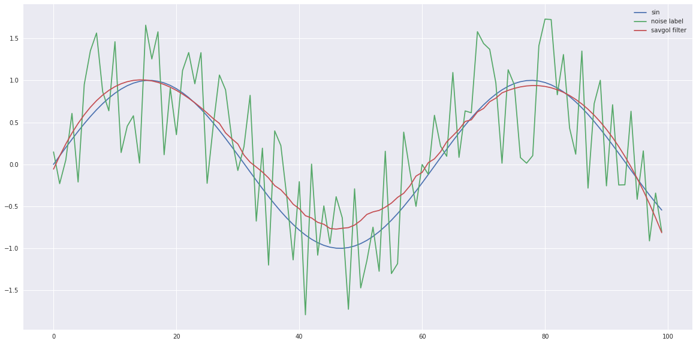
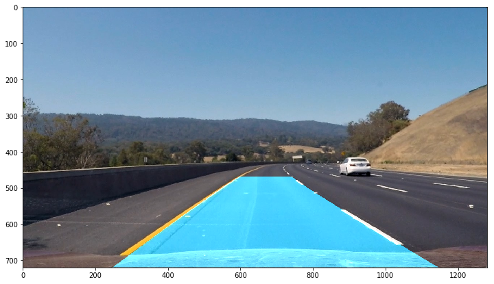
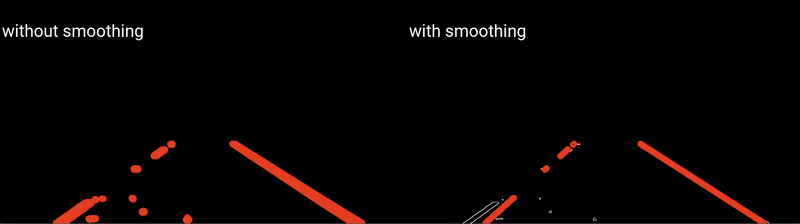
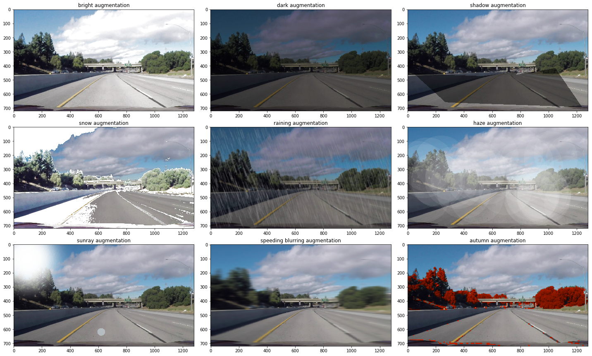
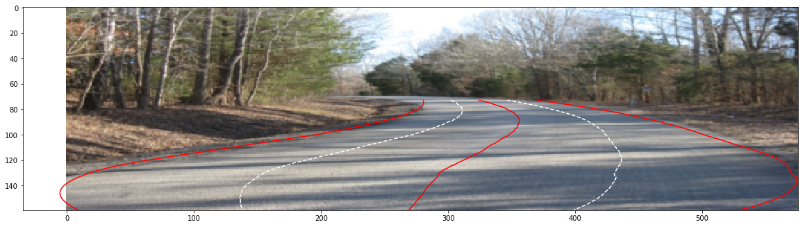

# Self-Driving-Cars-Engine

Gathers signal processing, computer vision, machine learning and deep learning for self-driving car engines.

## What-Done

1. Signal processing (1D smoothing, 2D smoothing, convolution 2 signals, pass-filters)
2. Simple straight lane detection
3. Steering suggestion
4. Multi-lane detection
5. Multi-lane angle
6. Curve-lane detection
7. Car detection using sliding + HOG + eXtreme Boosting
8. Object detection using Tensorflow
9. Distance + Angle for object detection
10. Distance + Speed for object detection
11. Traffic light detection
12. Gradient Smoothing
13. Lane Smoothing
14. Dynamic count lane detection
15. Road Segmentation
16. Plate detection
17. Image Augmentation
18. Lane Augmentation offroad

## Results

#### 1. [Signal processing](1.signal-processing)

#### 2. [simple straight lane detection](2.simple-straight-lane)

#### 3. [Steering suggestion](3.steering-suggestion)

#### 4. [Multi-lane detection](4.multi-lane-detection)

#### 5. [Multi-lane angle](5.multi-lane-angle)

#### 6. [Curve-lane detection](6.curve-lane-detection)

#### 7. [Car detection using sliding + HOG + eXtreme Boosting](7.car-detection-sliding-HOG-XGB)

#### 8. [Object detection using Tensorflow](8.object-detection-tensorflow)

#### 9. [Distance + Angle for object detection](9.object-distance-angle)

#### 10. [Distance + Speed for object detection](9.object-distance-speed)

#### 11. [Traffic light detection](11.traffic-light-detection)

#### 12. [Gradient Smoothing](12.gradient-smoothing)

#### 13. [Lane Smoothing](13.lane-smoothing)

#### 14. [Dynamic count lane detection](14.dynamic-count-lane)

#### 15. [Road Segmentation](15.segmentation)

VGG16 Road Segmentation

Mobilenet City Segmentation

#### 16. [Plate detection](16.plate-detection)

#### 17. [Image augmentation](17.augmentation)

#### 18. [Lane Augmentation offroad](18.lane-augmentation-offroad)

