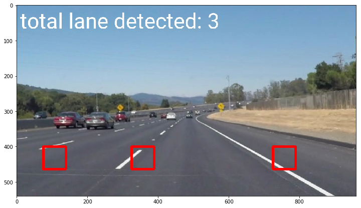
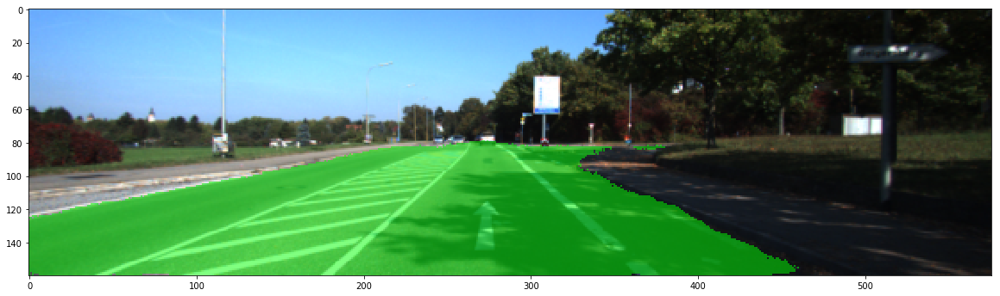
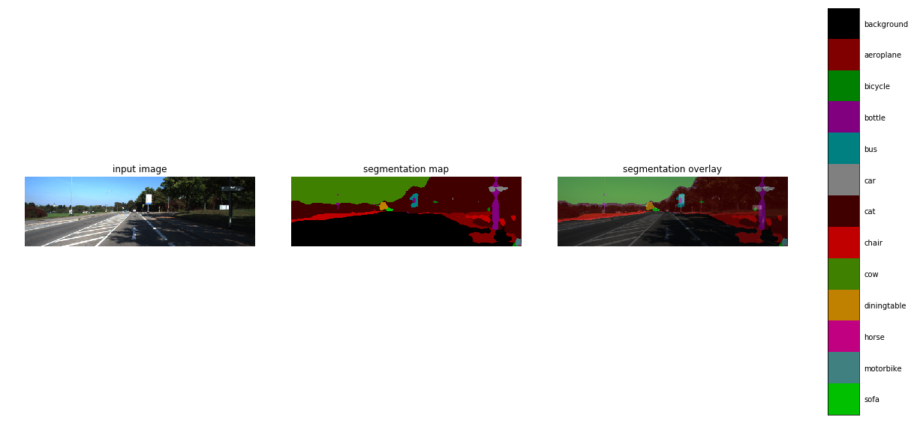
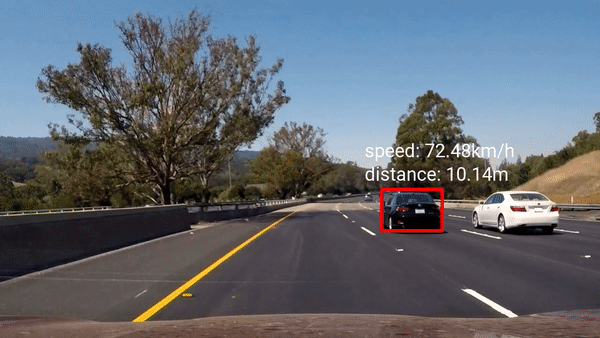
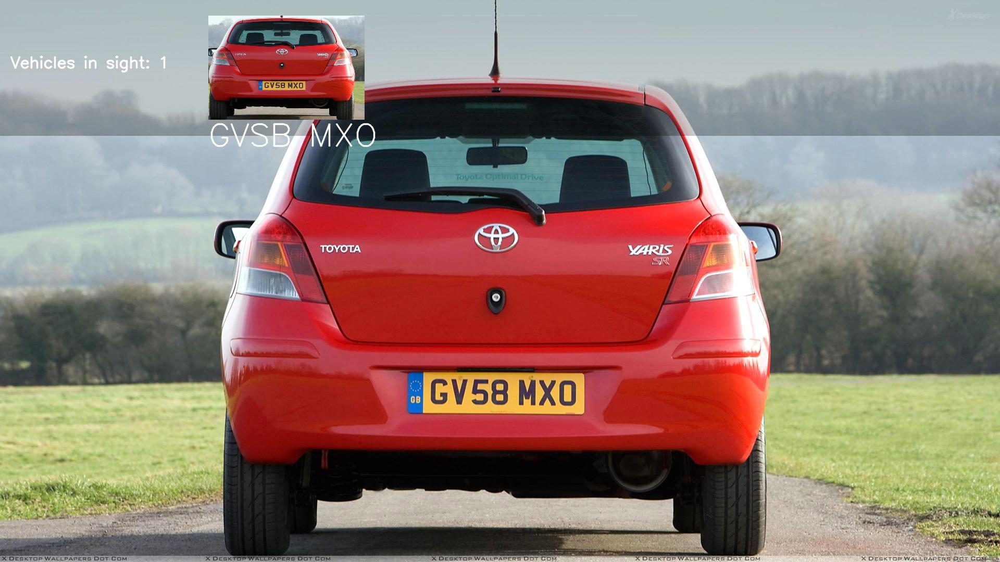

# Self-Driving-Cars-Engine

Gathers signal processing, computer vision, machine learning and deep learning for self-driving car engines.

## What-Done

1. Signal processing (1D smoothing, 2D smoothing, convolution 2 signals, pass-filters)
2. Simple straight lane detection
3. Steering suggestion
4. Multi-lane detection
5. Multi-lane angle
6. Curve-lane detection
7. Car detection using sliding + HOG + eXtreme Boosting
8. Object detection using Tensorflow
9. Distance + Angle for object detection
10. Traffic light detection
11. Gradient Smoothing
12. Lane Smoothing
13. Dynamic count lane detection
14. Segmentation
15. Distance + Speed for object detection
16. Plate detection

## Results

1. Signal processing

2. simple straight lane detection

3. Steering suggestion

4. Multi-lane detection

5. Multi-lane angle

6. Curve-lane detection

7. Car detection using sliding + HOG + eXtreme Boosting

8. Object detection using Tensorflow

9. Distance + Angle for object detection

10. Traffic light detection

11. Gradient Smoothing

12. Lane Smoothing

13. Dynamic count lane detection

14. Segmentation

VGG16 Road Segmentation

Mobilenet City Segmentation

15. Distance + Speed for object detection

16. Plate detection

