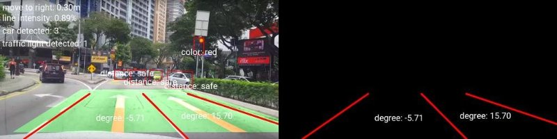
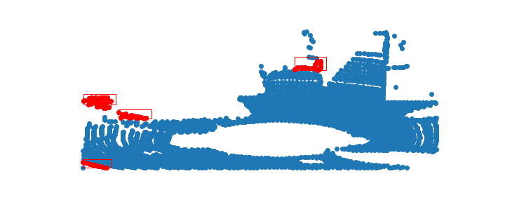

    

  

---

**Self-Driving-Cars-Engine**, Gathers signal processing, computer vision, machine learning and deep learning for self-driving car engines.

## What-Done

1. [Signal processing (1D smoothing, 2D smoothing, convolution 2 signals, pass-filters)](https://github.com/huseinzol05/Self-Driving-Car-Engines#1-signal-processing)
2. [Simple straight lane detection](https://github.com/huseinzol05/Self-Driving-Car-Engines#2-simple-straight-lane-detection)
3. [Steering suggestion](https://github.com/huseinzol05/Self-Driving-Car-Engines#3-steering-suggestion)
4. [Multi-lane detection](https://github.com/huseinzol05/Self-Driving-Car-Engines#4-multi-lane-detection)
5. [Multi-lane angle](https://github.com/huseinzol05/Self-Driving-Car-Engines#5-multi-lane-angle)
6. [Curve-lane detection](https://github.com/huseinzol05/Self-Driving-Car-Engines#5-multi-lane-angle)
7. [Car detection using sliding + HOG + eXtreme Boosting](https://github.com/huseinzol05/Self-Driving-Car-Engines#5-multi-lane-angle)
8. [Object detection using Tensorflow](https://github.com/huseinzol05/Self-Driving-Car-Engines#8-object-detection-using-tensorflow)
9. [Distance + Angle for object detection](https://github.com/huseinzol05/Self-Driving-Car-Engines#9-distance--angle-for-object-detection)
10. [Distance + Speed for object detection](https://github.com/huseinzol05/Self-Driving-Car-Engines#10-distance--speed-for-object-detection)
11. [Traffic light detection](https://github.com/huseinzol05/Self-Driving-Car-Engines#11-traffic-light-detection)
12. [Gradient Smoothing](https://github.com/huseinzol05/Self-Driving-Car-Engines#12-gradient-smoothing)
13. [Lane Smoothing](https://github.com/huseinzol05/Self-Driving-Car-Engines#13-lane-smoothing)
14. [Dynamic count lane detection](https://github.com/huseinzol05/Self-Driving-Car-Engines#14-dynamic-count-lane-detection)
15. [Road Segmentation](https://github.com/huseinzol05/Self-Driving-Car-Engines#15-road-segmentation)
16. [Plate detection](https://github.com/huseinzol05/Self-Driving-Car-Engines#16-plate-detection)
17. [Image Augmentation](https://github.com/huseinzol05/Self-Driving-Car-Engines#17-image-augmentation)
18. [Lane Augmentation offroad](https://github.com/huseinzol05/Self-Driving-Car-Engines#18-lane-augmentation-offroad)
19. [Sensor fusion](https://github.com/huseinzol05/Self-Driving-Car-Engines#19-sensor-fusion)

## Results

#### 1. [Signal processing](1.signal-processing)

#### 2. [simple straight lane detection](2.simple-straight-lane)

#### 3. [Steering suggestion](3.steering-suggestion)

#### 4. [Multi-lane detection](4.multi-lane-detection)

#### 5. [Multi-lane angle](5.multi-lane-angle)

#### 6. [Curve-lane detection](6.curve-lane-detection)

#### 7. [Car detection using sliding + HOG + eXtreme Boosting](7.car-detection-sliding-HOG-XGB)

#### 8. [Object detection using Tensorflow](8.object-detection-tensorflow)

#### 9. [Distance + Angle for object detection](9.object-distance-angle)

#### 10. [Distance + Speed for object detection](9.object-distance-speed)

#### 11. [Traffic light detection](11.traffic-light-detection)

#### 12. [Gradient Smoothing](12.gradient-smoothing)

#### 13. [Lane Smoothing](13.lane-smoothing)

#### 14. [Dynamic count lane detection](14.dynamic-count-lane)

#### 15. [Road Segmentation](15.segmentation)

VGG16 Road Segmentation

Mobilenet City Segmentation

#### 16. [Plate detection](16.plate-detection)

#### 17. [Image augmentation](17.augmentation)

Originally from https://github.com/UjjwalSaxena/Automold--Road-Augmentation-Library

#### 18. [Lane Augmentation offroad](18.lane-augmentation-offroad)

#### 19. [Sensor fusion](19.sensor-fusion)

